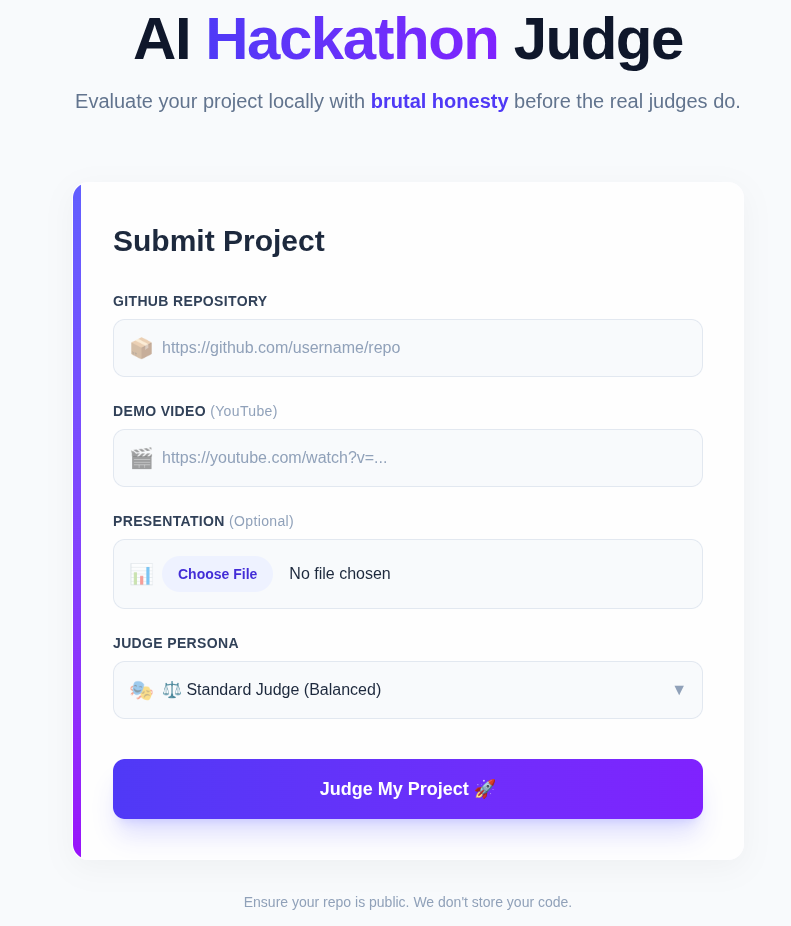
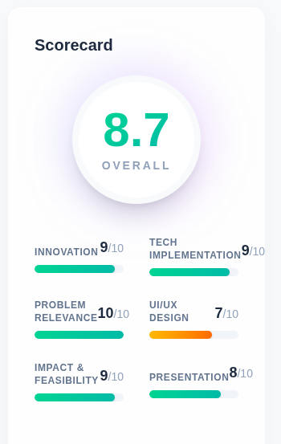
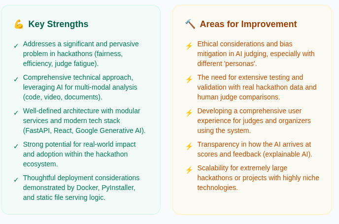
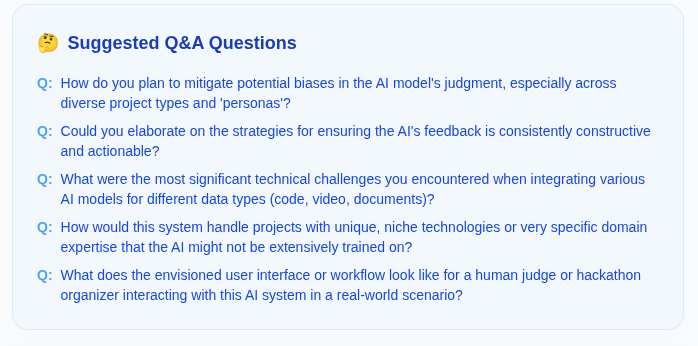
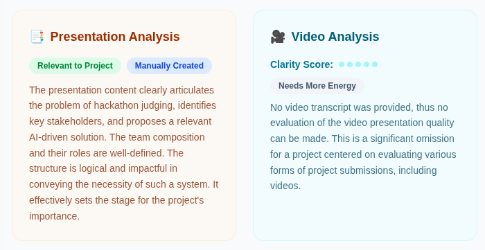
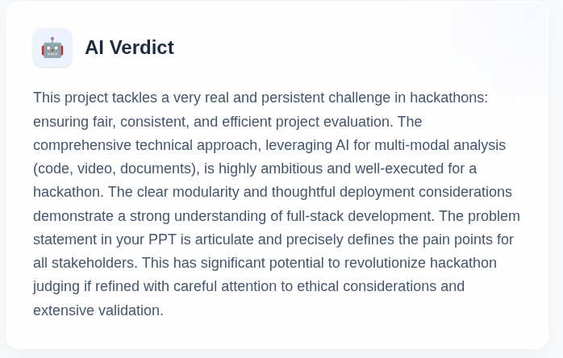
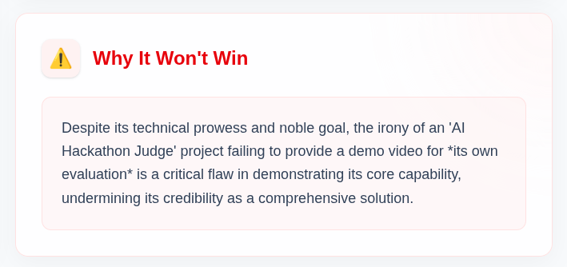

# AI Hackathon Judge 🤖⚖️

**Evaluate your hackathon project locally before the real judges do.**

An AI-powered tool that analyzes your GitHub repository, PPT, and demo video to provide instant scores, feedback, and a "Why You Won't Win" reality check.

<div align="center">
  
  <p><em>Compare your project against personas like 'The VC' or 'Roast Master'</em></p>
</div>

## ✨ New & Advanced Features

*   **👥 Multi-Judge Consensus scoring**: Parallel evaluation by 5 AI judge personas (VC, CTO, Product, UI/UX, Professor) to provide an aggregated, unbiased score.
*   **🛡️ Auto-Bug & Security Issue Detection**: Static analysis that finds hardcoded API keys, vulnerable dependencies, and logic flaws.
*   **❓ Auto-Generated Judge Questions**: Specific Q&A and Viva questions generated based on your project's unique tech stack and pitch.
*   **🏆 "Will It Win?" Prediction**: A data-driven (and brutal) prediction of your project's winning probability.
*   **📈 Video & Speech Analytics**: Instant metrics for confidence, clarity, and pacing from your demo video transcripts.
*   **🚀 Mentor Roadmap**: A tailor-made path from hackathon prototype to a production-ready product.

## 🖼️ Gallery

| Landing & Persona Picker | Detailed Scorecard | Strengths vs Weaknesses |
| :---: | :---: | :---: |
|  |  |  |

| Suggested Questions | Video Analysis | AI Final Verdict |
| :---: | :---: | :---: |
|  |  |  |

| Why It Won't Win |
| :---: |
|  |

## 🎭 Judge Personas

Choose who judges you!
*   ⚖️ **Standard**: Balanced feedback.
*   💸 **The VC**: Obsessed with ROI, market size, and scale ("Where's the moat?").
*   🧔🏻‍♂️ **The CTO**: Cranky about code quality, architecture, and security ("No tests? 0/10").
*   📦 **Product Manager**: Focuses on problem-solution fit and user experience.
*   🎨 **UI/UX Designer**: Strictly evaluates visual hierarchy and aesthetics.
*   🎓 **The Professor**: Looks for algorithmic efficiency and theoretical correctness.
*   🔥 **Roast Master**: Brutal, funny, and technically accurate insults.

## 🛠️ Tech Stack

*   **Frontend**: React, Vite, Tailwind CSS (v4)
*   **Backend**: Python, FastAPI
*   **AI**: Google Gemini 2.5 Flash (`models/gemini-2.5-flash` via `google-generativeai`)
*   **Analysis**: PyGithub (Repo Analysis), Speech-to-Text (Video Analysis)
*   **Deployment**: Docker & Docker Compose

## 🚀 Getting Started

### Option 1: Docker (Recommended for Dev)

1.  Ensure you have **Docker** and **Docker Compose** installed.
2.  Set your API keys in a `.env` file in the project root:
    ```bash
    GEMINI_API_KEY=your_key_here  # must allow models/gemini-2.5-flash
    GITHUB_TOKEN=your_token_here
    ```
3.  Run the application:
    ```bash
    docker-compose up --build
    ```
4.  Open `http://localhost:8000` in your browser.

### Option 2: Standalone Executable

**Linux**
1.  Download `project_judge_linux.zip` from Releases.
2.  Extract and run `./project_judge`.

**Windows**
1.  Run `build_windows.bat` to generate the `.exe`.
2.  Run `project_judge.exe`.

### Option 3: Manual Development Setup

**1. Backend**
```bash
cd backend
python -m venv venv
source venv/bin/activate
pip install -r requirements.txt
uvicorn main:app --reload --port 8000
```

**2. Frontend**
```bash
cd frontend
npm install
npm run dev
```

## 📝 Note

Built for hackathon winners (and those who need a reality check).
