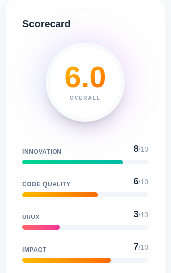
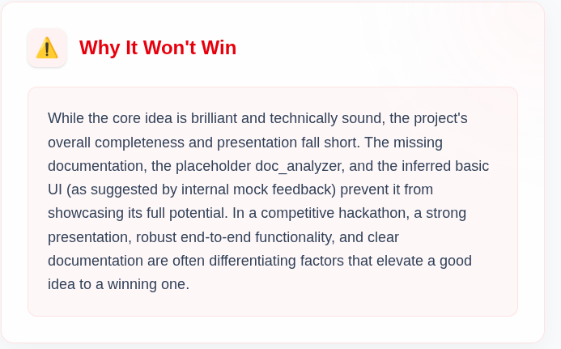

# AI Hackathon Judge 🤖⚖️

**Evaluate your hackathon project locally before the real judges do.**

An AI-powered tool that analyzes your GitHub repository and demo video to provide instant scores, feedback, and a "Why You Won't Win" reality check.

<div align="center">
  
  <p><em>Compare your project against personas like 'The VC' or 'Roast Master'</em></p>
</div>

| Scorecard | AI Feedback | Reality Check |
| :---: | :---: | :---: |
|  |  |  |

## ✨ Features

*   **🔍 Deep Repo Analysis**: Reads your README, file structure, and code to assess quality.
*   **🎥 Video Transcript Analysis**: Watches your YouTube demo to understand your pitch.
*   **🎭 Judge Personas**: Choose who judges you!
    *   ⚖️ **Standard**: Balanced feedback.
    *   💸 **The VC**: Obsessed with ROI and scale ("Where's the moat?").
    *   🧔🏻‍♂️ **The CTO**: Cranky about code quality ("No tests? 0/10").
    *   🔥 **Roast Master**: Brutal, funny, and technically accurate insults.
*   **💎 Modern UI**: Beautiful, glassmorphic light-theme design.

## 🛠️ Tech Stack

*   **Frontend**: React, Vite, Tailwind CSS (v4)
*   **Backend**: Python, FastAPI
*   **AI**: Google Gemini (via `google-generativeai`)
*   **Build**: PyInstaller (for standalone executable)

## 🚀 Getting Started

You can run the application either as a standalone executable or by setting up the development environment.

### Option 1: Standalone Executable (Recommended)

**Linux**
1.  Download `project_judge_linux.zip` from Releases.
2.  Extract it and run:
    ```bash
    ./project_judge
    ```
    *(Make sure your `.env` file with `GEMINI_API_KEY` is in the same folder)*

**Windows**
1.  Run `build_windows.bat` to generate the `.exe` (requires Python & Node.js).
2.  Run `project_judge.exe`.

### Option 2: Development Setup

**Prerequisites**
*   Node.js (v18+)
*   Python (v3.10+)
*   A Google Gemini API Key

**1. Backend Setup**
```bash
cd backend
python -m venv venv
source venv/bin/activate  # On Windows: venv\Scripts\activate
pip install -r requirements.txt

# Set your API Key
export GEMINI_API_KEY="your_api_key_here"

# Run the server
uvicorn main:app --reload --port 8000
```

**2. Frontend Setup**
```bash
cd frontend
npm install
npm run dev
```

Open `http://localhost:5173` in your browser.

## 📝 License

MIT License. Built for hackathon winners (and losers).
